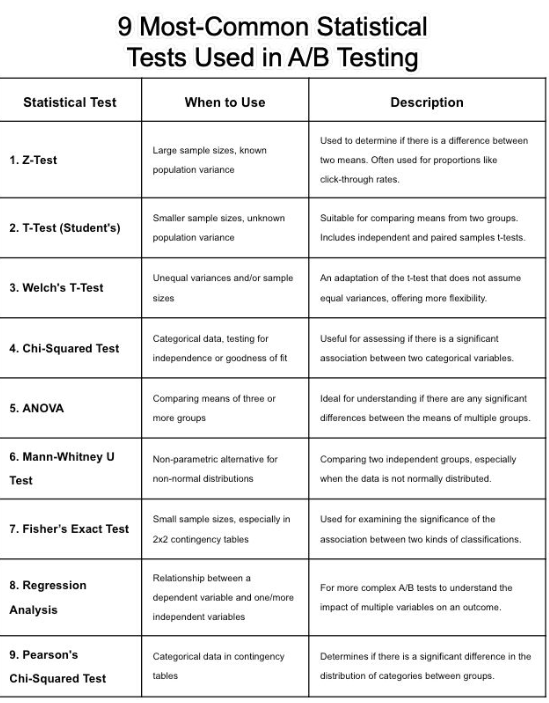

# TESTS STATISTIQUES

1. **Test Z** : Utilisé avec des tailles d’échantillon, variance connue de la population. Utilisé pour déterminer s’il existe une différence entre deux moyennes. Souvent utilisé pour des proportions telles que les taux de clics.
```bash
from statsmodels.stats.weightstats import ztest
import numpy as np`

# Générer deux ensembles de données aléatoires
data1 = np.random.normal(loc=5, scale=2, size=1000)
data2 = np.random.normal(loc=5.5, scale=2, size=1000)

# Test Z
stat, p = ztest(data1, data2)
print('Z statistic:', stat, 'P-value:', p)
```

2. **Test T (étudiant)** : Échantillons de plus petite taille, variance de la population inconnue. Convient pour comparer les moyennes de deux groupes. Comprend des tests t d’échantillons indépendants et appariés.

```bash
from scipy.stats import ttest_ind

# Générer deux ensembles de données aléatoires
data1 = np.random.normal(loc=5, scale=2, size=100)
data2 = np.random.normal(loc=5.5, scale=2, size=100)

# Test T
stat, p = ttest_ind(data1, data2)
print('T statistic:', stat, 'P-value:', p)

```

3. **Test T de Welch** : variances et/ou tailles d’échantillon inégales. Une adaptation du test t qui ne suppose pas de variances égales, offrant plus de flexibilité.
```bash
# Utiliser la même fonction que le test t, mais avec l'argument equal_var à False
stat, p = ttest_ind(data1, data2, equal_var=False)
print('Welch T statistic:', stat, 'P-value:', p)

```
4. **Test du chi carré** : données catégorielles, test d’indépendance ou de qualité de l’ajustement. Utile pour évaluer s’il existe une association significative entre deux variables catégorielles.
```bash
from scipy.stats import chi2_contingency

# Tableau de contingence
table = [[10, 20, 30], [6, 9, 17]]

# Test du chi carré
stat, p, dof, expected = chi2_contingency(table)
print('Chi-squared statistic:', stat, 'P-value:', p)

```
5. **ANOVA** : Comparaison des moyennes de trois groupes ou plus. Idéal pour comprendre s’il existe des différences significatives entre les moyennes de plusieurs groupes.
```bash
from scipy.stats import f_oneway

# Générer trois ensembles de données aléatoires
data1 = np.random.normal(loc=5, scale=2, size=100)
data2 = np.random.normal(loc=5.5, scale=2, size=100)
data3 = np.random.normal(loc=6, scale=2, size=100)

# ANOVA
stat, p = f_oneway(data1, data2, data3)
print('ANOVA F statistic:', stat, 'P-value:', p)

```
6. **Test U de Mann-Whitney** : Alternative non paramétrique au test Z / test T pour les distributions non normales. Comparaison de deux groupes indépendants, en particulier lorsque les données ne sont pas normalement distribuées.
```bash
from scipy.stats import mannwhitneyu

# Test U de Mann-Whitney
stat, p = mannwhitneyu(data1, data2)
print('Mann-Whitney U statistic:', stat, 'P-value:', p)

```
7. **Test exact de Fisher** : Échantillons de petite taille, en particulier dans les tableaux de contingence 2x2. Utilisé pour examiner la signification de l’association entre deux types de classifications.
```bash
from scipy.stats import fisher_exact

# Tableau 2x2
table = [[8, 2], [1, 5]]

# Test exact de Fisher
_, p = fisher_exact(table)
print('P-value:', p)

```

8. **Analyse de régression** : Relation entre une variable dépendante et une ou plusieurs variables indépendantes. Pour des tests A/B plus complexes afin de comprendre l’impact de plusieurs variables sur un résultat.
```bash
import statsmodels.api as sm

# Générer des données aléatoires
X = np.random.normal(0, 1, 100)
y = X * 5 + np.random.normal(0, 2, 100)

# Ajouter une constante à X
X = sm.add_constant(X)

# Modèle de régression linéaire
model = sm.OLS(y, X).fit()
print(model.summary())

```
9. **Test du chi carré de Pearson** : données catégorielles dans les tableaux de contingence. Détermine s’il existe une différence significative dans la répartition des catégories entre les groupes.
```bash
# Utiliser le même exemple que pour le test du chi carré général
stat, p, dof, expected = chi2_contingency(table)
print('Pearson Chi-squared statistic:', stat, 'P-value:', p)

```

