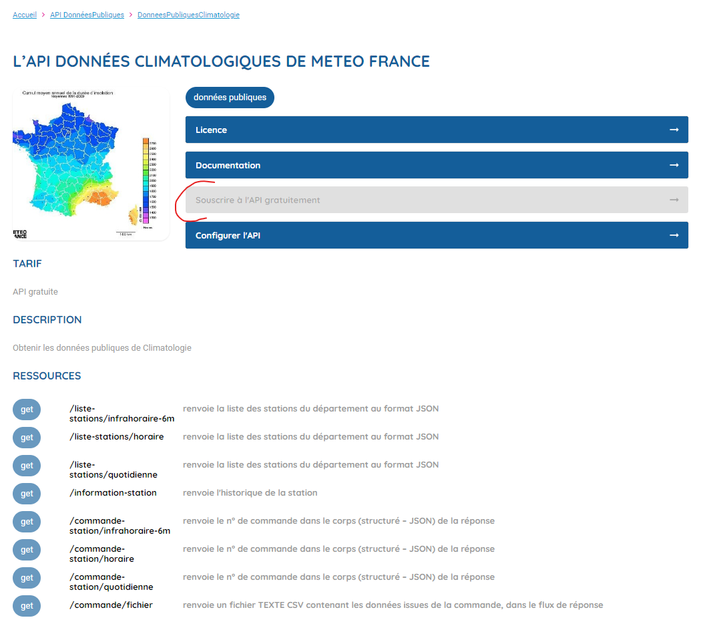
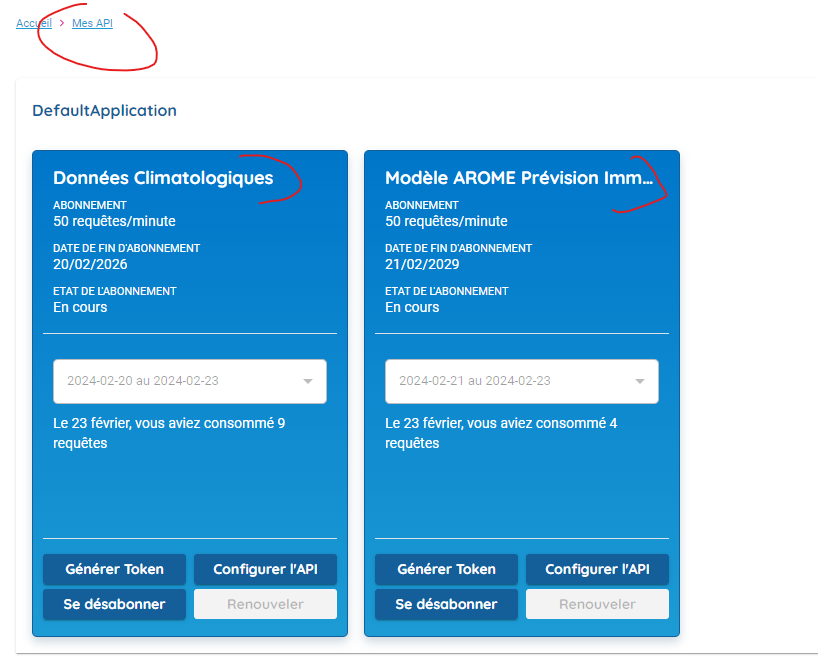
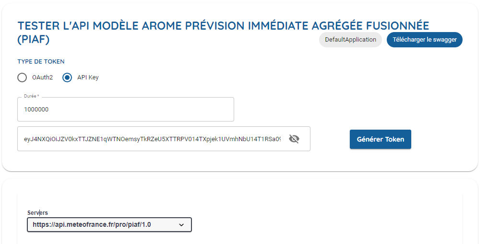
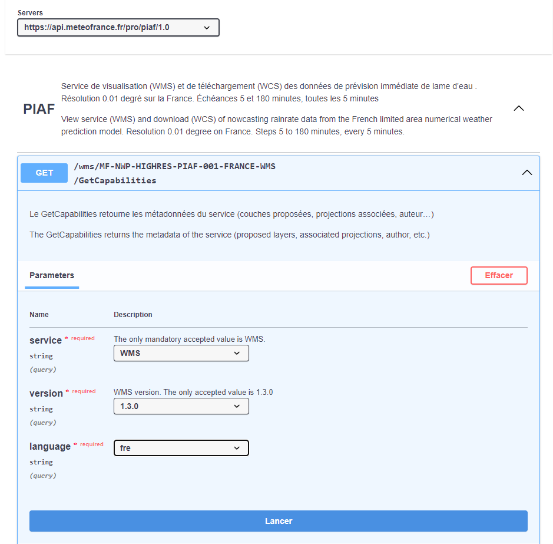
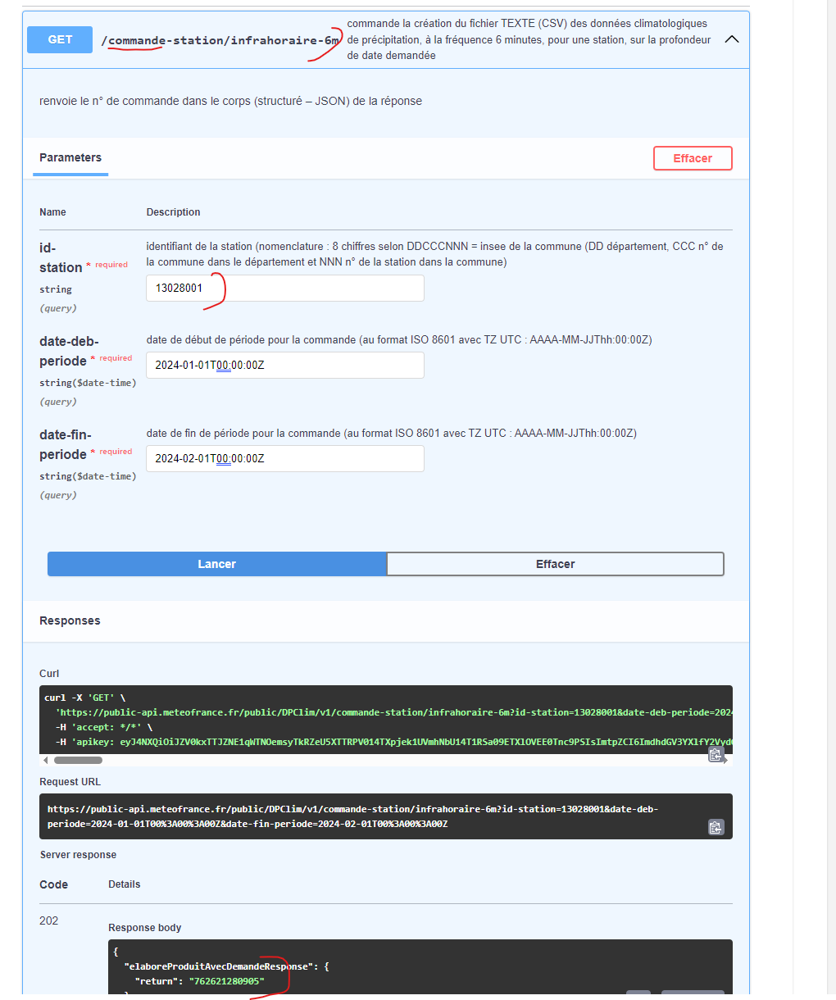

# FONCTIONNENT API KEY DE METEO FRANCE
## Information importante
A date:
 - l'API au pas infrahoraire-6m ne contient qu'une seule colonne RR6 qui correspond à la pluviométrie
 - On ne peut telecharger de fichiers du jour, dans le meilleur des cas on ne peut telecharger que la veille

# Obtenir une API Key de Météo-France


## . Créer un compte sur le site de Météo-France

- **Rendez-vous sur le site de Météo-France** : [https://donneespubliques.meteofrance.fr/](https://donneespubliques.meteofrance.fr/)
- **Cliquez sur "Créer un compte"** et suivez les instructions.
- Remplissez les informations demandées, y compris votre nom, votre adresse e-mail et un mot de passe.
- Activez votre compte en cliquant sur le lien reçu dans votre boîte mail.

## se rendre sur le catalogue des API et souscrire aux api utiles pour le projet

## . Obtenir l'API Key





- **Connectez-vous à votre compte** sur le site de Météo-France.
- Cliquez sur votre nom d'utilisateur en haut à droite de la page.
- !! attention pour se connecter il faut mettre le login et non l'email
- Dans le menu déroulant, **sélectionnez "Mes API Keys"**.
- Cliquez sur le bouton **"Créer une API Key"**.
- Donnez un nom à votre API Key et sélectionnez **"Données Publiques"** comme type d'accès.
- Lisez et acceptez les conditions générales d'utilisation.
- Cliquez sur le bouton **"Créer"**.
- Votre API Key sera affichée. **Copiez-la** car elle ne sera affichée qu'une seule fois.

## . Récupérer les données publiques

Vous pouvez désormais utiliser votre API Key pour récupérer les données publiques de Météo-France.

- La documentation de l'API est disponible ici : `[URL de la documentation]`
- Vous pouvez utiliser différents outils pour interroger l'API, comme par exemple :
  - Wget: [https://www.gnu.org/software/wget/](https://www.gnu.org/software/wget/)
  - Curl: [https://curl.haxx.se/](https://curl.haxx.se/)
  - Python: [https://realpython.com/python-requests/](https://realpython.com/python-requests/)

### Exemple de requête pour obtenir un fichier météo

```bash
curl -X GET \
  "https://donneespubliques.meteofrance.fr/donnees/hygrometrie/synthese/heure/6/2023/01/01/2023/12/31?token=VOTRE_API_KEY&format=json" \
  -o meteo_6min_2023.json
```
Remplacez VOTRE_API_KEY par votre API Key.
2023/01/01 et 2023/12/31 par les dates de début et de fin de votre période d'intérêt.
6 par le pas de temps en minutes (6 minutes dans cet exemple).
json par le format de sortie souhaité (json ou csv).


# API Météo France

L'API de Météo France permet d'accéder à des données météorologiques pour différentes stations et à différentes périodes. Le processus se divise en deux grandes parties : la commande des données et le téléchargement des fichiers correspondants.

## Partie 1 : Commande des données

Pour commander des données météorologiques, on utilise un lien de commande qui spécifie les détails de la requête, tels que l'identifiant de la station, la période désirée, etc.

### Exemple de commande

Pour obtenir les données météo d'une station spécifique toutes les heures entre deux dates, on utilise l'URL suivante :

https://public-api.meteofrance.fr/public/DPClim/v1/commande-station/horaire?id-station=13110003&date-deb-periode=2024-01-21T01%3A00%3A00Z&date-fin-periode=2024-02-20T01%3A00%3A00Z

**Paramètres :**
- `id-station` : Identifiant unique de la station météorologique.
- `date-deb-periode` : Date et heure de début de la période désirée (format ISO 8601).
- `date-fin-periode` : Date et heure de fin de la période désirée (format ISO 8601).

Cette commande retourne un identifiant de commande (`id-cmde`) qui sera utilisé pour télécharger les fichiers contenant les données demandées.

## Partie 2 : Téléchargement des fichiers

Une fois la commande effectuée et l'identifiant de commande obtenu, on peut télécharger les fichiers de données à l'aide d'un second URL, en utilisant l'`id-cmde` fourni précédemment.

### Exemple de téléchargement

Pour télécharger les fichiers correspondant à la commande, on utilise l'URL suivant :

https://public-api.meteofrance.fr/public/DPClim/v1/commande/fichier?id-cmde=


**Paramètres :**
- `id-cmde` : Identifiant de la commande obtenue lors de la première étape.

Il est important de remplacer la partie `id-cmde=` par l'identifiant de commande réel pour pouvoir procéder au téléchargement des données.

## Conclusion

L'API de Météo France offre une méthode structurée pour accéder à des données météorologiques détaillées par station et par période. Le processus nécessite initialement de passer une commande spécifiant les critères de sélection des données, puis d'utiliser l'identifiant de commande pour télécharger les fichiers correspondants.
